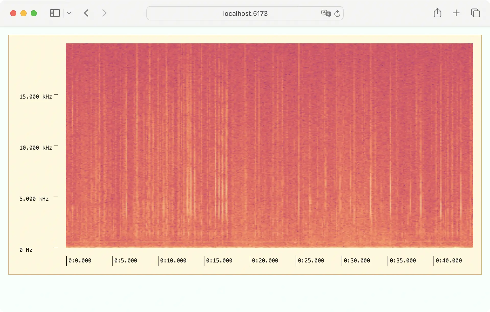

# Basic Spectrogram



This example demonstrates how to render an image and axes.

In your application provider, use `Specviz.Axis.Provider` to provide the axes.

```tsx
import * as Specviz from "@meridian_cfi/specviz"

function AppProvider(props) {
  const axes = React.useMemo(
    () => ({
      seconds: ...
      hertz: ...
      decibels: ...
      myaxis: ...
    }),
    [],
  )
  return (
    <Specviz.Axis.Provider value={axes}>
      <...>
        {props.children}
      </...>
    </Specviz.Axis.Provider>
  )
}
```

To create the axes, `Axis.time` and `Axis.frequency` are
used. To create a custom axis, use `Axis.linear` and `Axis.nonlinear`.

```tsx
function AppProvider(props) {
  const axes = React.useMemo(
    () => ({
      seconds: Specviz.Axis.time(0, 60),
      hertz: Specviz.Axis.frequency(20000, 0),
    }),
    [],
  )
  return ...
}
```

Finally, use the `Specviz.Plane.Provider` to designate particular axes to the
visualization.

```tsx
function App() {
  return (
    <Specviz.Plane.Provider xaxis="seconds" yaxis="hertz">
      <div>
        <Specviz.Axis.Horizontal />
      </div>
      <div>
        <Specviz.Axis.Vertical />
      </div>
      <div>
        <Specviz.Visualization src="./spectrogram.png" />
      </div>
    </Specviz.Plane.Provider>
  )
}
```
