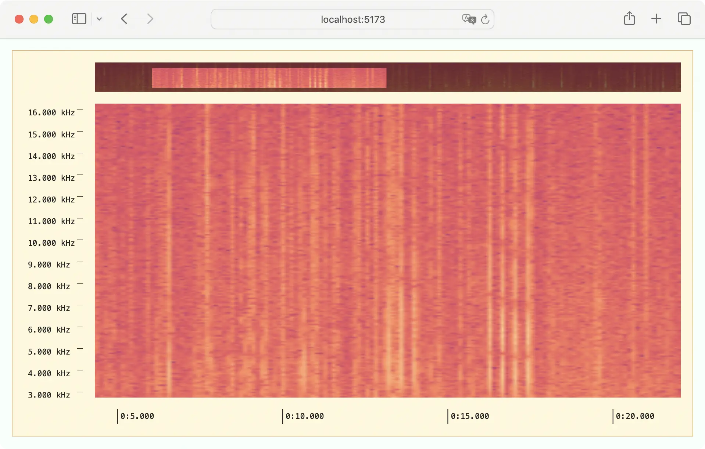

# Interactive Spectrogram



This example demonstrates how to create an interactive visualization, allowing the user to zoom, pan, and jump to specific locations.

`Specviz.Input.Provider` enables interaction and `Specviz.Viewport.Provider` allows viewport state to be shared across components.

```tsx
function AppProvider(props) {
  const loaderData = RRT.useLoaderData<typeof loader>()
  const axes = ...
  return (
    <Specviz.Axis.Provider value={axes}>
      <Specviz.Input.Provider>
        <Specviz.Viewport.Provider>
          <...>
            {props.children}
          </...>
        </Specviz.Viewport.Provider>
      </Specviz.Input.Provider>
    </Specviz.Axis.Provider>
  )
}
```

Define the actions for your application.

```tsx
function App() {
  const viewport = Specviz.Viewport.useContext()
  const zoomX = ({ dx, dy, event }) => {
    viewport.zoomScroll(-dy, 0)
  }
  const zoomY = ({ dx, dy, event }) => {
    viewport.zoomScroll(0, -dy)
  }
  const pan = ({ dx, dy, event }) => {
    viewport.scroll(-dx, -dy)
  }
  ...
}
```

Assign actions to Specviz components using `Specviz.Action.Provider`.

```tsx
<Specviz.Action.Provider onWheel={zoomX}>
  <Specviz.Axis.Horizontal />
</Specviz.Action.Provider>

<Specviz.Action.Provider onWheel={zoomY}>
  <Specviz.Axis.Vertical />
</Specviz.Action.Provider>

<Specviz.Action.Provider onDrag={pan}>
  <Specviz.Visualization src={...} />
</Specviz.Action.Provider>
```
