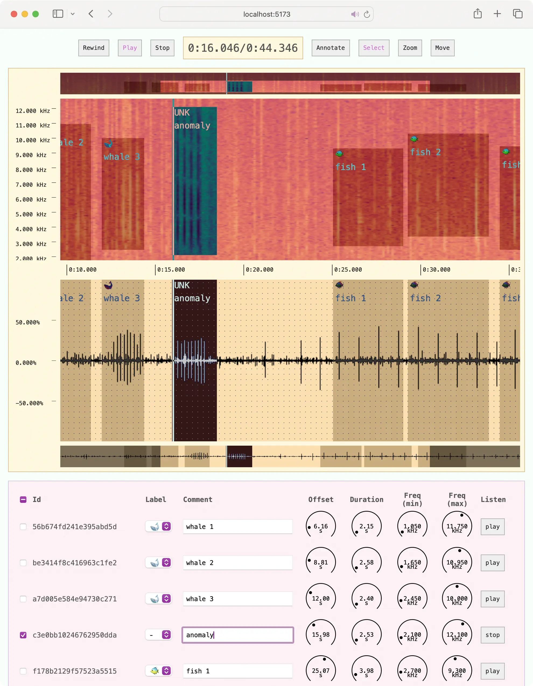

# Get Started

Specviz is a customizable javascript library to display pre-computed spectrograms, built on top of [React](https://react.dev), [SVG](https://developer.mozilla.org/en-US/docs/Web/SVG), and [WebAudio](https://developer.mozilla.org/en-US/docs/Web/API/Web_Audio_API). It currently provides the following main features, most of which can be opted in or out:

* Pre-computed spectrogram and waveform loading
* Zoom and pan navigation synchronized across multiple visuals
* Corresponding audio file playback
* Annotation tool for creating bounding boxes on the spectrogram and adding domain-specific data
* Listen to annotated regions with real-time frequency audio filter
* User-defined layouts and styles

Note that this library does not currently handle the spectrogram computation. This must be handled by the user in the backend or frontend and supplied to Specviz with a URL. It was originally inspired by [wavesurfer.js](https://wavesurfer-js.org/) and APLOSE.



## Starter Projects

This repo contains several example packages to demostrate various features and configurations of Specviz. Clone the repository and run the examples to use as a starting point for your project.

* [Basic Spectrogram](../examples/basic-spectrogram.mdx)
* [Basic Audio](../examples/basic-audio.mdx)
* [Basic Annotation](../examples/basic-annotation.mdx)
* [Interactive Spectrogram](../examples/interactive-spectrogram.mdx)
* [Advanced Annotation](../examples/advanced-annotation.mdx)

To run the examples, install the development dependencies, change to the example's directory, and run the `dev` script.

```sh
$ bun install
$ cd examples/advanced-annotation
$ bun dev
```

The example webserver will display the connection URL. In the default case, [http://localhost:5173](http://localhost:5173).

```none
VITE v5.4.8  ready in 205 ms

➜  Local:   http://localhost:5173/
➜  Network: use --host to expose
➜  press h to show help
```
